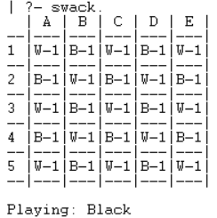
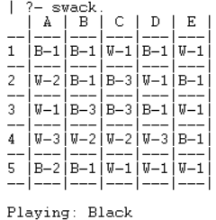
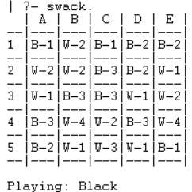

# PLOG 2020/2021 - TP1

## Group: T07G0

| Name             | Number    | E-Mail              |
| ---------------- | --------- | ------------------- |
| Gustavo Sena     | 201806078 | up201806078@fe.up.pt|
| Maria Baia       | 201704951 | up201704951@fe.up.pt|

----
## ****Swack****

### ****Game Description****
        Consiste num jogo para duas pessoas e dois conjuntos de peças (pretas e brancas) em que é atribuída a cada pessoa um conjunto de peças com a respetiva cor.
    
        O jogo inicia-se sobre um tabuleiro de formato quadrangular, que poderá variar em qualquer tamanho, coberto num padrão xadrez por peças pretas e brancas. No caso de o tabuleiro ser de dimensão ímpar nas laterais, o padrão deverá ter uma peça branca no centro do tabuleiro.

### ****Rules****
        A primeira jogada é feita pelo jogador que contêm as peças pretas, alterando com o jogador que contêm as peças brancas, tendo cada um na sua respetiva jogada a possibilidade de “make a move” ou de passar a jogada ao próximo. Em caso de jogar, o respetivo jogador poderá mover a parte superior de uma pilha da sua cor (pilha com a peça superior da cor do jogador), para uma pilha inimiga adjacente (pilha com a peça superior da cor do jogador oposto), desde que ambas as pilhas tenham o mesmo tamanho (mesmo número de peças) antes da jogada ser feita.

        O jogo termina quando ambos os jogadores passarem a jogada sucessivamente. O vencedor será o jogador com a pontuação mais alta. Essa pontuação é o tamanho do seu maior grupo, isto é, o maior número de pilhas adjacentes, da mesma cor, possíveis de alcançar. Em caso de empate, cada jogador acrescenta à sua pontuação o tamanho do seu segundo maior grupo, que poderá ser igual ao do grupo anterior. Se o empate persistir, o terceiro maior grupo também é contado e assim sucessivamente.


### ****Internal representation of the GameState****

        A representação interna do tabuleira foi feita a partir de uma lista que representa o tabuleiro. Esta contêm listas que representam cada linha, que por sua vez contêm listas associadas a uma pilha de peças, sendo que a head da lista representa a peça superior da pilha.

        As peças brancas são identificadas por "white", e as pretas por "black".

- Inicial Board:
```
initialBoard([
    [[white], [black], [white], [black], [white]], 
    [[black], [white], [black], [white], [black]], 
    [[white], [black], [white], [black], [white]], 
    [[black], [white], [black], [white], [black]], 
    [[white], [black], [white], [black], [white]]
]).
```

- Middle Board:
```
middleBoard([
    [[black], [black], [white], [black], [white]], 
    [[white,black], [black], [black,white,black], [white], [black]], 
    [[white], [black,white,black], [black,white,white], [black], [white]], 
    [[white,black,white], [white,black], [white,black], [white,black,white], [black]], 
    [[black,white], [black], [white], [white], [white]]
]).
```

- Final Board:
```
finalBoard([
    [[black], [white,black], [black], [black,white], [black,white]], 
    [[white,black], [white,black], [black,white,black], [black,white], [white]], 
    [[white], [black,white,black], [black,white,white], [white], [black,white]], 
    [[white,black,white], [white,black], [white,black], [white,black,white], [black]], 
    [[black,white], [black], [white], [white], [white]]
]).
```

### ****Visualization of the GameState****

        Para a visualizaçao do tabuleiro foi implementado o predicado "displayBoard" que tem como objetivo mostrar o estado do jogo, percorrendo de forma recursiva as listas existentes, e imprimindo todos os elementos.

- Inicial Board:
<br>


- Middle Board:
<br>


- Final Board:
<br>
