# PLOG 2020/2021 - TP1

## Group: T07G0

| Name             | Number    | E-Mail              |
| ---------------- | --------- | ------------------- |
| Gustavo Sena     | 201806078 | up201806078@fe.up.pt|
| Maria Baia       | 201704951 | up201704951@fe.up.pt|

## Execução

Para executar o  jogo:

- Instale e execute o SICStus Prolog.
- Selecione File > Consult e selecione o file [* swack.pl *] (Code / swack.pl).
- Digite `swack` na consola SICStus para iniciar o jogo.

----
## ****Swack****
<br>

### ****Introdução****
<br>

No âmbito da unidade curricular de PLOG, foi-nos proposto a implementação de um jogo de tabuleiro utilizando a linguagem de Prolog. Este jogo foi desenvolvido para três modos de utilização: Humano/Humano, Humano/Computador e Computador/Computador, no qual as jogadas do Computador têm dois níveis diferentes à escolha do utilizador.

Foi feita uma interface, para interação do utilizador com o jogo, através da linha de comando.

<br>

### ****Game Description****
<br>

Consiste num jogo para duas pessoas e dois conjuntos de peças diferentes (pretas e brancas) em que é atribuída a cada pessoa um conjunto de peças com a respetiva cor.
    
O jogo inicia-se sobre um tabuleiro de formato quadrangular, com tamanho variável, coberto num padrão xadrez por peças pretas e brancas. No caso de o tabuleiro ser de dimensão ímpar nas laterais, o padrão deverá ter uma peça branca no centro do tabuleiro.

<br>

### ****Rules****
<br>

A primeira jogada é feita pelo jogador que contêm as peças pretas, alterando com o jogador que contêm as peças brancas, tendo cada um na sua respetiva jogada a possibilidade de jogar ou passar a jogada ao próximo. No caso de jogo, o jogador poderá mover a parte superior de uma pilha da sua cor (pilha com a peça superior da cor do jogador), para uma pilha inimiga adjacente lateral (pilha com a peça superior da cor do jogador oposto), desde que ambas as pilhas tenham o mesmo tamanho (mesmo número de peças) antes da jogada ser feita.

O jogo termina quando ambos os jogadores passarem a jogada sucessivamente. O vencedor será o jogador com a pontuação mais alta. Essa pontuação é o tamanho do seu maior grupo, isto é, o maior número de pilhas adjacentes, da mesma cor, possíveis de alcançar. Em caso de empate, cada jogador acrescenta à sua pontuação o tamanho do seu segundo maior grupo, que poderá ser igual ao do grupo anterior. Se o empate persistir, o terceiro maior grupo também é contado e assim sucessivamente. Se o empate mantiver-se até não haver mais grupos a acrescentar, para os tabuleiros de tamanho par, o vencedor será o joador que fez o último movimento.

<br>

### ****Lógica do Jogo****
<br>

#### ****Representação do Estado do Jogo****
<br>

A representação interna do estado do jogo foi feita a partir de uma lista que representa o tabuleiro. Esta contêm listas que representam cada linha, que por sua vez contêm listas associadas a uma pilha de peças, sendo que o último elemento da lista representa a peça superior da pilha.

As peças brancas são identificadas por "white", e as pretas por "black". No entanto, de modo a facilitar a vizualização das peças do jogo ao utilizador, para representar cada peça usamos os seguintes átomos:

<br>

        | Atom | Meaning            |
        | ---- | ------------------ |
        |  X   | White Piece        |
        |  Y   | Black Piece        |

<br>

Para exemplificar, temos três tabuleiro de tamanho 5x5 que representem três estados do jogo:

- Estado Inicial:
```
initialBoard([
    [[white], [black], [white], [black], [white]], 
    [[black], [white], [black], [white], [black]], 
    [[white], [black], [white], [black], [white]], 
    [[black], [white], [black], [white], [black]], 
    [[white], [black], [white], [black], [white]]
]).
```

- Estado Intermédio:
```
middleBoard([
    [[black], [black], [white], [black], [white]], 
    [[white,black], [black], [black,white,black], [white], [black]], 
    [[white], [black,white,black], [black,white,white], [black], [white]], 
    [[white,black,white], [white,black], [white,black], [white,black,white], [black]], 
    [[black,white], [black], [white], [white], [white]]
]).
```

- Estado Final:
```
finalBoard([
    [[black], [white,black], [black], [black,white], [black,white]], 
    [[white,black], [white,black], [black,white,black], [black,white], [white]], 
    [[white], [black,white,black], [black,white,white], [white], [black,white]], 
    [[white,black,white], [white,black], [white,black], [white,black,white], [black]], 
    [[black,white], [black], [white], [white], [white]]
]).
```
<br>

#### ****Visualização do Estado do Jogo****
<br> 

#### *****Tabuleiro*****
<br> 

Para a visualizaçao dos diferentes estados do jogo, foi implementado o predicado `display_game(+GameState, +Player)` que recebe como parâmetros uma lista do estado do jogo atual e o jogador que jogou na última jogada. Este utiliza 4 predicados auxiliares:

<br>

- `printHead(+Size)`: Imprime o cabeçalho do tabuleiro, ordenado desde a letra A até à letra correspondente ao tamanho do tabuleiro.
- `printBar(+Size)`: Imprime uma barra de separação entre as linhas do tabuleiro. 
- `printBoard(+Size, +N, +Board)`: Recursivamente imprime o estado do tabuleiro recebido, com auxílio de 2 predicados, `printLine(+X)`, que imprime uma linha do tabuleiro, e novamente o predicado `printBar(+Size)`.
- `subsPlayer(Player, NextPlayer)`: Que dá o próximo jogador.

<br>

As seguintes figuras mostram o tabuleiro em três estados do jogo:

- Inicial Board:
<br>
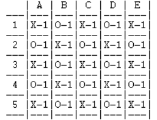

- Middle Board:
<br>
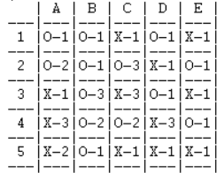

- Final Board:
<br>
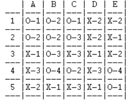

<br>

#### *****Interface*****
<br> 

No início da execução do programa, é dada uma interface ao utilizador para este poder pré-defenir o jogo que deseja jogar:

- Começa por o utilizador escolher o tamanho do tabuleiro a ser usado, confirmando a sua opção.
<br><br>
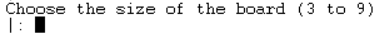

- De seguida, é lhe dado 3 opções de modos de jogo: 
<br><br>
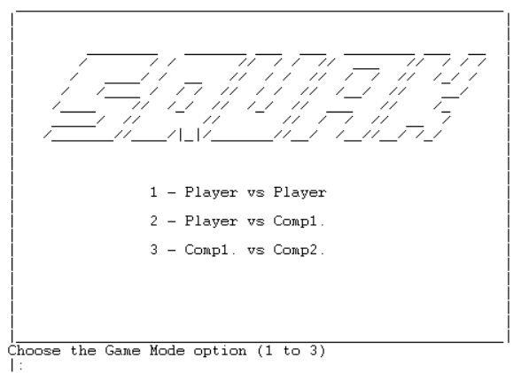

- Após o utilizador ter selecionado o modo de jogo, inverde em 3 situações possíveis:

    - No caso de ter selecionado a opção 1, o jogo começa de imediato.
    <br><br>
    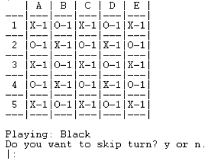

    - No caso de ter selecionado a opção 2, o utilizador terá de escolher quais as suas peças (de modo a defenir quem começa a jogar) e qual o nível de dificuldade do computador.
    <br><br>
    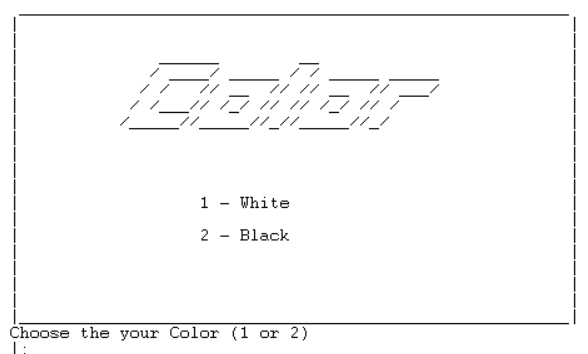
    <br>
    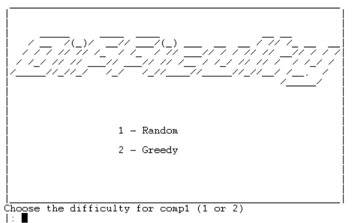

    - No caso de ter selecionado a opção 3, o utilizador terá de escolher a dificuldade para o primeiro computador (que irá ter as peças pretas), e para o segundo computador (que irá ter as peças brancas).
    <br><br>
    
    <br>
    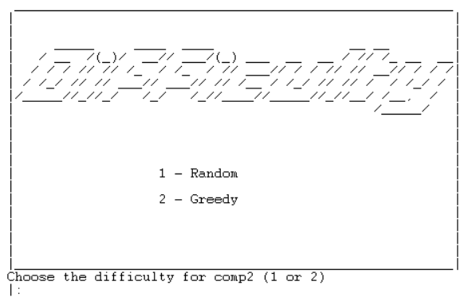

<br>

#### *****Tratamento de inputs*****       
<br>

De modo a evitar leituras inesperadas dos inputs dados pelo utilizador, implementamos predicados de validação que dado um input, verifica se esse é válido ou não, e no caso de não o ser pede uma nova tentativa.

Através do predicado utilizado para criar uma interface com o utilizador, de modo a que esse possa pré-defenir o jogo que pretende jogar (`mainMenu(-Size, -Player1, -LevelP1, -Player2, -LevelP2, -Option)`), este lê as decisões tomadas e verifica se são decisões válidas ou não.

Tanto para a decisão do tamanho do tabuleiro (`decideSizeBoard(-Size)`), como na decisão do modo de jogo (`decideGameMode(Player1, LevelP1, Player2, LevelP2, Option)`), através de um predicado de leitura (`readSize(-NSize)`, `readOption(-Option)`, `readDifficulty(-Dif, +Comp)`, `readPlayerColor(-Color)`) que lê as escolhas feitas pelo utilizador, consoante as opções que lhe são dadas (`printMainMenu`, `printWinner(Winner)`, `printColor`, `printDifficulty`), estas são validadas (`validateSize(+NSize)`, `validateOption(Option)`, `validatePlayerColor(+Color)`, `validateDifficulty(+Dif)`). No caso de não ser uma opção válida ou exceder o número de opções dadas, o respetivo predicado falha e pede uma nova opção. 

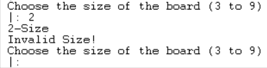

*Invalid Board Size Option*

<br>

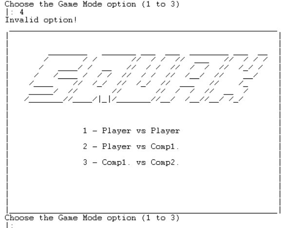

*Invalid Game Mode Option*

<br>

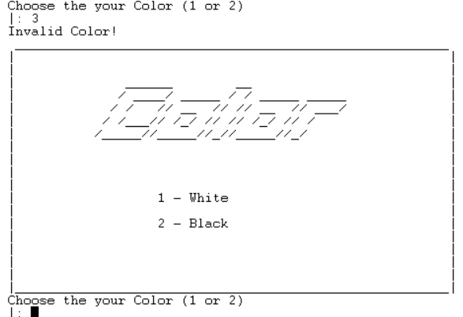

*Invalid Color Option*

<br>

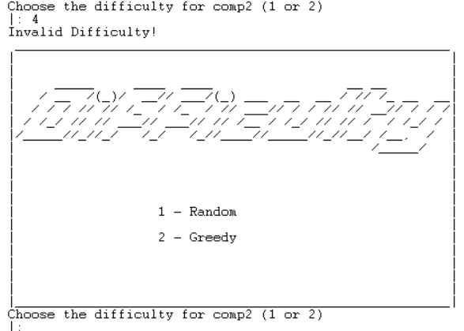

*Invalid Difficulty Option*


#### ****Execução de Jogadas****
<br>

A execução de uma jogada é feita através do predicado `move(+GameState, +Move, -NewGameState)`. Este recebe o estado atual do tabuleiro e as coordenadas da posição atual da peça a mover e da nova posição. Recorrendo a 2 predicados auxiliares, o predicado `insertStack(+OldBoard, -NewBoard, +Column, +Row, +Color)` insere a peça a mover na pilha da nova posição, e o predicado `removeStack(+OldBoard, -NewBoard, +Column, +Row, -Color)` remove da pilha da posição atual a peça do jogador, e substitui-a pela peça do jogador oposto. Por fim, as alteração feitas por estes 2 predicados são guardadas numa nova variável NewGameState.


Porém, para ser executada a jogada é preciso saber as coordenadas da posição atual da peça que o jogador quer mover e as coordenadas da nova posição. Sendo assim, é utilizado o predicado `getMove(+Player, +Board, -CurrColumn, -CurrRow, -NewColumn, -NewRow, -Answer)` e de 3 predicados auxiliares:

- `skip(-Answer)`: Antes de saber quais as coordenadas para ser executado o movimento, é colocada a questão ao jogador se ele quer passar a vez.
<br><br>
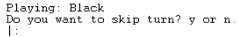

- `getCurrPiece(+Player, +Board, +CurrColumn, +CurrRow)`: Através do predicado `getCoord(-Column, -Row, +Size)` obtemos as coordenadas dadas pelo jogador, e de seguida essas coordenadas são validadas de modo a verificar se a peça que o jogador quer mover realmente pertence ao mesmo (`checkCurrCoord(+Player, +Board, +CurrColumn, +CurrRow)`).
<br><br>
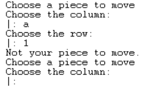

- `getNewPiece(+Player, +Board, +CurrColumn, +CurrRow, -NewColumn, -NewRow)`: Usando a mesma lógica para obter as coordenadas dadas pelo jogador, utiliza-se o predicado `getCoord(-Column, -Row, +Size)`, obtendo as novos coordenadas para mover a peça. Neste caso é verificado se a nova posição dada pelas coordenadas pertence ao jogador oposto, se as duas pilhas das posição atual e da nova posição têm o mesmo comprimento, e se a nova posição é adjacente à posição atual.
<br><br>
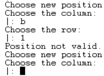

<br>

#### ****Lista de Jogadas Válidas****
<br>

De modo a obter uma lista de jogadas válida, é utilizado o predicado `valid_moves(+Board, +Player, -ListOfMoves)`, ao qual recebe o estado do tabuleiro e o jogador atuais. Este recorre ao predicado `setof` para encontrar todas as jogadas possíveis, atribuindo-lhes o valor que o jogador adquiria com essa jogada, satisfazendo o predicato `generateMove(+Player, +Board,-CurrColumn-CurrRow-NewColumn-NewRow)`,  `move(Board, CurrColumn, CurrRow, NewBoard, NewColumn, NewRow, Player)` e `once(getValue(UpdatedBoard, NewBoard, Player, Value, 0, NewColumn, NewRow))`

O predicado `generateMove(+Player, +Board,-CurrColumn-CurrRow-NewColumn-NewRow)` gera posições em que a peça de cima da pilha de cada coordenada gerada pertença ao jodador atual (`checkGeneratePosition(+Player, +Board, -CurrColumn-CurrRow)`) e gera novas posições adjacentes (`checkGenerateMove(+Player, +Board, -CurrColumn-CurrRow-NewColumn-NewRow)`) em que a nova posição gerada pertenca ao jogador oposto e que as duas pilhas da posição gerada e da nova posição gerada tenham o mesmo comprimento (`checksProposedMove(+Player, +Board, -CurrColumn-CurrRow-NewColumn-NewRow)`).

O predicado `move(Board, CurrColumn, CurrRow, NewBoard, NewColumn, NewRow, Player)`, neste caso específico, seria apenas usado para simular um novo tabuleiro de jogo com a jogada gerada, de modo a obter o valor adquirido ao jogador, através do predicado `once(getValue(UpdatedBoard, NewBoard, Player, Value, 0, NewColumn, NewRow))`

Por fim, utiliza-se o predicado `reverso` para obter a jogada que aquire o maior valor ao jogador na primeira posição.

<br>

#### ****Jogada do Computador****
<br>

A jogada do computador é feita através do predicado `choose_move(+GameState, +Player, +Lever, -Move, -Skip)`, que dependendo do nível escolhido pelo utilizador, vão ocorrer duas escolhas distintas do predicado.
- No caso de o nível ser 'rand', dada uma lista de jogadas válidas obtidas pelo predicado `valid_moves`, obtem-se um valor aleatório através do predicado `random`, que será utilizado no predicado `nth0`, para obter as coordenadas da jogada do computador, localizadas na posição aleatória da lista.
-No caso de o nível ser 'greedy', será utilizado o predicado `nth0`, para obter as coordenadas da jogada do computador, localizadas na posição primeira posição da lista dada pelo predicado `valid_moves`.

No entanto, nos dois casos, se a lista obtida pelo predicado `valid_moves` estiver fazia, será considerado que computador passou a vez.

<br>

#### ****Avaliação do Tabuleiro****
<br>

Para determinar o valor do maior grupo, ou seja, o maior número de pilhas adjacentes, da mesma cor, possíveis de alcançar para um determinado estado do tabuleiro e o jogador, implementamos o predicado `value(+GameState, +Player, -Value)`. Este utiliza o predicado `valueCicle(+Board, +Player, -Value, +OldValue)`, que é chamado recursivamente, guardando numa lista todos os grupos encontrados para o jogador currente, até não haver mais coordenadas do tabuleiro a visitar.

O predicado `valueCicle(+Board, +Player, -Value, +OldValue)` recorre ao auxilio de 3 predicados:
- `searchForColor(+Board, +Color, +CurrCol, +CurrRow, -Col, -Row)`: A partir de uma dada posição, encontra a próxima coordenada ao qual a peça superior da sua pilha pertença a cor recebida.
- `getValue(-UpdatedBoard3, +Board, +Player, -ReturnValue3, +Value, +CurrColumn, +CurrRow)`: Obtém o comprimento do grupo, fornecendo uma posição pertencente a esse grupo.
- `append`: Junta numa lista os valores já encontrados com o novo valor encontrado, para que o predicado `valueCicle` possa ser novamente chamado com uma lista de novos valores.

<br>

#### ****Final do Jogo****
<br>

O jogo termina quando os dois jogadores, sejam eles pessoa ou computador, passarem a jogada sucessivamente.

Essa verificação é feita após ser utilizado o predicado que executa a jogada de cada jogador, consoante a sua posição no jogo (`movePlayer1`, `movePlayer2`, `moveComp1`, `moveComp2`).

Sendo assim, é chamado o predidaco `game_over(+GameState, -Winner, +LastPlayed)`, que obtem os valor dos grupos para cada jogador, e de seguida recorre ao predicado `getWinner(+WhiteScore, +BlackScore, -Winner, +LastPlayed)` que devolve o vencedor do jogo.

O predicado `getWinner(+WhiteScore, +BlackScore, -Winner, +LastPlayed)` recebe a lista de valores de cada jogador e ordena-as por ordem decrescente. Com auxilio do predicado `getBiggestList(+WhiteOrdered, +BlackOrdered, -Biggest, +LastPlayed)` verifica, a partir do primeiro elemento de cada lista de valores relativos a cada jogador, qual o vencedor. No caso de empate, verifica o próximo valor em cada lista. Se o empate persistir  até não haver mais elementos nas lista, o vencedor será o jogador que fez o último movimento.

Por fim é dado display para consola do jogador vencedor (`printWinner(+Winner)`).

<br>

### ****Conclusão****
<br>

Sentimos que desenvolvimento deste trabalho exigiu de nós um grande esforço e empenho, principalmente por Prolog ser-nos uma linguagem completamente nova.

As dificuldades encontradas ao longo do projeto, foram, principalmente relacionadas com situações de backtracking, no entanto, todos esses problemas foram ultrapassados.

### ****Bibliografia****
<br>

- [Documentação do Sicstus](https://sicstus.sics.se/sicstus/docs/latest4/html/sicstus.html/)
- [Documentação do SWI Prolog](https://www.swi-prolog.org/)
- Slides fornecidos no Moodle
- [Documentação do Swack](https://boardgamegeek.com/boardgame/314462/swack)